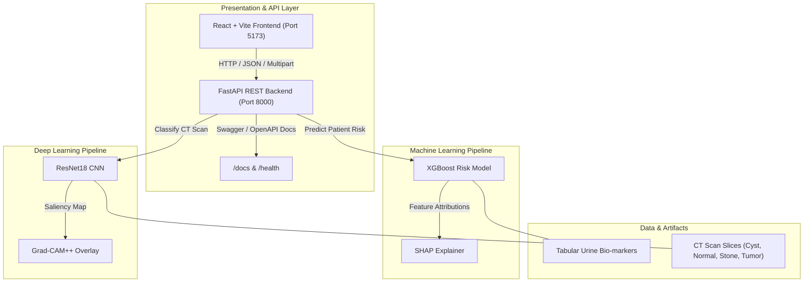

# StoneSense-AI

StoneSense-AI is an Explainable AI (XAI) decision-support platform for kidney-stone assessment. It independently analyzes structured urine biomarkers with XGBoost and CT scan slices with ResNet18, providing SHAP and Grad-CAM explanations for each evidence stream.

The project features a high-performance **FastAPI backend**, a modern **React (Vite + TypeScript + Tailwind CSS)** web dashboard, and automated machine learning and deep learning pipelines. By leveraging **Grad-CAM** for spatial CT slice heatmaps and **SHAP** for local biomarker contribution scoring, StoneSense-AI bridges the gap between complex AI predictions and trustworthy clinical decision support.

Designed for robust developer productivity, StoneSense-AI comes equipped with end-to-end automation scripts (Windows Batch and PowerShell), rigorous backend unit and integration test suites, latency benchmarking tools, and comprehensive API documentation.



---

## Features

- **CT Kidney Image Classification**: Deep learning image classification of abdominal CT scan slices into four categories (`Cyst`, `Normal`, `Stone`, `Tumor`).
- **Kidney Stone Risk Prediction**: Machine learning tabular risk scoring based on patient urine biochemistry parameters.
- **Explainable AI (XAI)**: Dual-layer interpretability engine combining visual and feature-level attributions.
- **Grad-CAM Visualization**: Class-activation heatmap generation highlighting focal renal regions on CT slices.
- **SHAP Feature Importance**: Local and global TreeSHAP waterfall and summary plots detailing urine biomarker risk factors.
- **REST APIs**: Fast, typed FastAPI endpoints for health readiness, model metadata, clinical risk prediction, and CT image assessment.
- **React Dashboard**: Modern dark-themed UI built with Vite, TypeScript, and Tailwind CSS.
- **Health Monitoring & Model Metadata**: Real-time system hardware status (CUDA/CPU) and model accuracy indicators.
- **Swagger Documentation**: Self-documenting OpenAPI specifications accessible at `/docs` and `/redoc`.
- **Trustworthy Assessment**: Presents independent clinical-risk and imaging evidence together with transparent, rule-based evidence agreement and decision support.

---

## Tech Stack

| Category                 | Technologies / Libraries                                                        |
| :----------------------- | :------------------------------------------------------------------------------ |
| **Frontend**             | React 18, Vite 5, TypeScript 5, Tailwind CSS 3, React Router v6, Axios          |
| **Backend**              | Python 3.10+, FastAPI, Uvicorn, Pydantic v2, Python-Multipart                   |
| **Machine Learning**     | XGBoost, Scikit-Learn, Pandas, NumPy                                            |
| **Deep Learning**        | PyTorch, torchvision (ResNet18), Pillow, OpenCV                                 |
| **Explainability**       | SHAP (SHapley Additive exPlanations), Grad-CAM (PyTorch-GradCAM)                |
| **Deployment & Scripts** | Windows Batch (`.bat`), PowerShell (`.ps1`), Uvicorn ASGI Server                |
| **Testing & Quality**    | Pytest, Pytest-Asyncio, HTTPX, Coverage.py, ESLint, TypeScript Compiler (`tsc`) |

---

## Project Structure

```text
StoneSense-AI/
├── backend/                  # FastAPI REST API Backend
│   ├── app/                  # Application core, routes, schemas, services
│   │   ├── api/v1/routes/    # API endpoints (health, predict, models)
│   │   ├── core/             # Configuration & environment setup
│   │   ├── schemas/          # Pydantic request & response data contracts
│   │   ├── services/         # Business logic and model loading orchestrators
│   │   └── utils/            # Image processing & helper utilities
│   ├── tests/                # Unit, integration, & latency benchmark tests
│   ├── main.py               # FastAPI entrypoint
│   └── requirements.txt      # Shared Python dependencies
├── frontend/                 # React + Vite Frontend Application
│   ├── src/
│   │   ├── components/       # Reusable UI components (PatientForm, ImageUpload, etc.)
│   │   ├── layouts/          # Page layouts & navigation header
│   │   ├── pages/            # View pages (Home, Risk, Detection)
│   │   ├── services/         # Axios API client layer
│   │   ├── types/            # TypeScript data model contracts
│   │   ├── main.tsx          # React application root entrypoint
│   │   └── index.css         # Tailwind CSS directives & global styles
│   ├── package.json          # Frontend Node.js dependencies & scripts
│   └── vite.config.ts        # Vite build & plugin configuration
├── ml/                       # Machine Learning Pipeline (Tabular Risk Prediction)
│   ├── datasets/             # Raw & split tabular urine datasets
│   ├── preprocessing/        # Data validation, EDA, & feature engineering scripts
│   ├── training/             # XGBoost model training & evaluation scripts
│   ├── explainability/       # SHAP explanation generation
│   ├── models/               # Serialized model artifacts (.pkl, .json)
│   └── outputs/              # Generated EDA and SHAP charts & reports
├── dl/                       # Deep Learning Pipeline (CT Scan Image Classification)
│   ├── datasets/             # CT scan image slices (train/val/test)
│   ├── preprocessing/        # Image validation, transforms, & EDA scripts
│   ├── training/             # ResNet18 PyTorch training & evaluation scripts
│   ├── explainability/       # Grad-CAM heatmap generation
│   ├── models/               # Model checkpoints (.pth, .pt)
│   └── outputs/              # Confusion matrices & saliency maps
├── infra/                    # Infrastructure & deployment assets
├── logs/                     # Automated log directory (created by scripts)
├── developer_launcher.bat    # Interactive Batch Developer Console
├── developer_launcher.ps1    # Interactive PowerShell Developer Console
├── install_all.bat           # One-click environment installer
├── run_all.bat               # Simultaneous full-stack launcher
├── run_backend.bat           # Backend launcher
├── run_frontend.bat          # Frontend dev server launcher
├── run_ml.bat                # ML pipeline menu launcher
├── run_dl.bat                # DL pipeline menu launcher
└── stop_all.bat              # Safe process termination script
```

---

## Installation

### Prerequisites

- **Python**: Version 3.10 or higher
- **Node.js**: Version 18.0 or higher
- **npm**: Version 9.0 or higher
- **Git**: Installed and available in system PATH

### Complete Setup

The easiest way to install all virtual environments and dependencies is using the automated installer from the project root:

```cmd
install_all.bat
```

To install individual components manually:

#### 1. Backend Setup

```cmd
python -m venv backend\.venv
call backend\.venv\Scripts\activate
pip install --upgrade pip
    pip install -r requirements.txt
deactivate
```

#### 2. Frontend Setup

```cmd
cd frontend
npm install
cd ..
```

#### 3. Machine Learning Setup

```cmd
python -m venv ml\.venv
call ml\.venv\Scripts\activate
    pip install -r requirements.txt
deactivate
```

#### 4. Deep Learning Setup

```cmd
python -m venv dl\.venv
call dl\.venv\Scripts\activate
    pip install -r requirements.txt
deactivate
```

---

## Quick Start

### Option 1: Launch Everything (Recommended)

Run the full-stack launcher to start both backend and frontend servers simultaneously:

```cmd
run_all.bat
```

What this does:

1. Verifies virtual environments and checks ports `8000` and `5173`.
2. Launches FastAPI Backend in a dedicated terminal window on `http://127.0.0.1:8000`.
3. Launches Vite Frontend in a dedicated terminal window on `http://localhost:5173`.
4. Automatically opens both the Web UI (`http://localhost:5173`) and Swagger API Documentation (`http://127.0.0.1:8000/docs`) in your browser.

### Option 2: Run Components Individually

- **Backend**: `run_backend.bat`
- **Frontend**: `run_frontend.bat`
- **ML Pipeline Console**: `run_ml.bat`
- **DL Pipeline Console**: `run_dl.bat`

---

## Developer Automation Scripts

| Script                                                                                  | Type       | Purpose & Description                                                                      |
| :-------------------------------------------------------------------------------------- | :--------- | :----------------------------------------------------------------------------------------- |
| [`developer_launcher.bat`](file:///c:/Users/akhil/StoneSense-AI/developer_launcher.bat) | Batch      | Interactive Developer Console menu with single-key access to all commands.                 |
| [`developer_launcher.ps1`](file:///c:/Users/akhil/StoneSense-AI/developer_launcher.ps1) | PowerShell | Advanced PowerShell menu with colored logs, automatic port detection, and log rotation.    |
| [`install_all.bat`](file:///c:/Users/akhil/StoneSense-AI/install_all.bat)               | Batch      | Verifies Python/Node prerequisites and builds all 3 virtual environments and npm packages. |
| [`run_backend.bat`](file:///c:/Users/akhil/StoneSense-AI/run_backend.bat)               | Batch      | Activates `backend\.venv` and starts Uvicorn with auto-reload on port 8000.                |
| [`run_frontend.bat`](file:///c:/Users/akhil/StoneSense-AI/run_frontend.bat)             | Batch      | Verifies `node_modules` and starts Vite React dev server on port 5173.                     |
| [`run_ml.bat`](file:///c:/Users/akhil/StoneSense-AI/run_ml.bat)                         | Batch      | Interactive console for executing tabular ML pipeline steps.                               |
| [`run_dl.bat`](file:///c:/Users/akhil/StoneSense-AI/run_dl.bat)                         | Batch      | Interactive console for executing vision DL pipeline steps.                                |
| [`run_all.bat`](file:///c:/Users/akhil/StoneSense-AI/run_all.bat)                       | Batch      | Launches Backend & Frontend processes in parallel and opens browser tabs.                  |
| [`stop_all.bat`](file:///c:/Users/akhil/StoneSense-AI/stop_all.bat)                     | Batch      | Asks for user confirmation and safely stops `node.exe`, `python.exe`, and `uvicorn.exe`.   |

### Execution Examples

```cmd
:: Using Batch Launchers
run_all.bat
run_backend.bat

:: Using PowerShell Launchers
.\developer_launcher.ps1
```

---

## Running ML Pipeline

Run `run_ml.bat` to launch the interactive ML pipeline menu:

1. **Validate Dataset**: Runs `ml/preprocessing/validate_ml_dataset.py` to inspect missing values, schema consistency, and data types.
2. **Run EDA**: Executes `ml/preprocessing/run_ml_eda.py` to calculate feature distributions, correlations, outliers, and generate visual summary charts.
3. **Preprocess Dataset**: Runs `ml/preprocessing/preprocessing_pipeline.py` to perform feature engineering, transformations, scaling, and train/test splits.
4. **Train ML Model**: Executes `ml/training/train_risk_model.py` to fit and compare XGBoost models, producing accuracy metrics and confusion matrices.
5. **Run SHAP**: Runs `ml/explainability/shap_explainer.py` to compute TreeSHAP values, global feature importance charts, and local attribution plots.

---

## Running DL Pipeline

Run `run_dl.bat` to launch the interactive DL pipeline menu:

1. **Validate Dataset**: Runs `dl/preprocessing/validate_dl_dataset.py` to check CT image slice integrity, corrupted files, and class directory structure.
2. **Run EDA**: Executes `dl/preprocessing/run_dl_eda.py` to analyze image resolution distributions, channel color stats, and class balance.
3. **Preprocess Images**: Runs `dl/preprocessing/image_preprocessor.py` to resize, normalize, and construct PyTorch DataLoaders.
4. **Train ResNet18**: Executes `dl/training/train_resnet18.py` to train the ResNet18 classifier with early stopping and learning rate scheduling.
5. **Evaluate Model**: Runs `dl/training/evaluate.py` to compute classification reports, per-class F1-scores, and confusion matrices.
6. **Run Grad-CAM**: Executes `dl/explainability/gradcam.py` to generate visual saliency maps highlighting focal CT regions.

---

## Running Backend

Start the backend service directly:

```cmd
call backend\.venv\Scripts\activate
cd backend
uvicorn app.main:app --reload --host 127.0.0.1 --port 8000
```

- **Service Base URL**: `http://127.0.0.1:8000`
- **Interactive Swagger Docs**: `http://127.0.0.1:8000/docs`
- **ReDoc Documentation**: `http://127.0.0.1:8000/redoc`
- **Health Check Endpoint**: `http://127.0.0.1:8000/api/v1/health`

---

## Running Frontend

Start the frontend application directly:

```cmd
cd frontend
npm install
npm run dev
```

- **Development Server**: `http://localhost:5173`
- **Production Build**: `npm run build` (outputs optimized bundle to `frontend/dist/`)
- **Preview Production Build**: `npm run preview`

---

## API Documentation

FastAPI automatically generates interactive OpenAPI documentation at `http://127.0.0.1:8000/docs`.

### Key Endpoints

| Method | Endpoint                | Description                                | Request Payload             | Response Payload                                       |
| :----- | :---------------------- | :----------------------------------------- | :-------------------------- | :----------------------------------------------------- |
| `GET`  | `/`                     | Service root identity check                | None                        | `{"message": "Welcome to StoneSense AI API"}`          |
| `GET`  | `/api/v1/health`        | Hardware & system readiness status         | None                        | `HealthResponse` (status, device, models loaded)       |
| `GET`  | `/api/v1/models`        | Active model metadata & validation metrics | None                        | `ModelInfoResponse` (accuracies, features, layers)     |
| `POST` | `/api/v1/predict/risk`  | Tabular urine biomarker risk scoring       | `PatientInformation` (JSON) | `RiskPrediction` (probability, risk_level, confidence) |
| `POST` | `/api/v1/predict/image` | CT scan slice image classification         | `image` (Multipart Form)    | `StoneDetection` (class_name, confidence, latency)     |

---

## AI Models

### 1. ResNet18 (Deep Learning CT Classifier)

- **Architecture**: Residual Network (18 layers) fine-tuned for medical imaging.
- **Classes**: `Cyst`, `Normal`, `Stone`, `Tumor`.
- **Why it's used**: ResNet's shortcut connections prevent vanishing gradients, allowing deep spatial feature extraction from CT slices while remaining lightweight for real-time inference.

### 2. XGBoost (Machine Learning Risk Predictor)

- **Architecture**: Gradient Boosted Decision Trees (GBDT).
- **Features**: Specific Gravity, pH, Osmolality, Conductivity, Urea, Calcium.
- **Why it's used**: XGBoost delivers state-of-the-art predictive performance on tabular clinical biomarkers and seamlessly integrates with TreeSHAP for exact feature attribution.

---

## Explainable AI

StoneSense-AI implements dual-layer interpretability to eliminate "black-box" predictions:

### 1. Grad-CAM (Visual Saliency Maps)

- Computes gradients of the target class score with respect to the feature maps of the final convolutional layer of ResNet18 (`layer4[-1]`).
- Produces a coarse heat map overlay highlighting the exact pixels in the CT slice that contributed to the model's decision (`Stone`, `Cyst`, etc.).

### 2. TreeSHAP (Tabular Feature Attributions)

- Calculates exact game-theoretic Shapley values across urine parameters (`calcium`, `pH`, `gravity`).
- Quantifies positive or negative contribution margins for individual patient risk scores.

---

## Frontend Pages

- **Home (`/`)**: System dashboard displaying real-time server health, active hardware (CUDA/CPU), model accuracy stats, and feature cards.
- **Risk Prediction (`/risk-prediction`)**: Interactive patient biomarker input form that submits measurements and displays predicted stone risk probability.
- **Stone Detection (`/stone-detection`)**: Medical image upload portal for evaluating CT scan slices with instant classification feedback.
- **Risk Prediction (`/risk-prediction`)**: Provides the complete clinical feature form, XGBoost risk probability, SHAP contribution directions, and clinical model transparency.
- **Stone Detection (`/stone-detection`)**: Provides CT image validation, ResNet18 classification, visible Grad-CAM output, and imaging model transparency.

### Methodology and dataset limitation

StoneSense AI independently analyzes clinical/tabular information with XGBoost and CT images with ResNet18. SHAP and Grad-CAM explain the respective model outputs. The evidence summary is a transparent rule-based comparison; it does not average probabilities or represent a new fused model.

The current clinical and CT datasets were independently sourced and are not patient-level paired. The models were not trained or validated together, and the application must not be interpreted as providing a clinical diagnosis. Future work could use a patient-level paired dataset for true multimodal fusion and joint validation.

- **404 Not Found (`/404`)**: Custom error page providing smooth navigation back to the application dashboard.

---

## Testing

Backend tests are written using `pytest` and `httpx`:

```cmd
cd backend
..\backend\.venv\Scripts\pytest
```

- **Unit Tests**: Test data schema validations and model loading logic.
- **Integration Tests**: Verify FastAPI route status codes and API contracts.
- **Performance Benchmarks**: `tests/performance/benchmark_inference.py` evaluates request-response latency under simulated load.

---

## Performance

The system performance parameters recorded in internal evaluation reports:

| Metric / Model                  | CT ResNet18 Classifier | Tabular XGBoost Predictor |
| :------------------------------ | :--------------------- | :------------------------ |
| **Validation Accuracy**         | **98.50%**             | **91.67%**                |
| **Macro / Validation F1-Score** | **0.9793**             | **0.9091**                |
| **Matthews Correlation (MCC)**  | —                      | **0.8452**                |
| **Average Latency**             | < 120 ms               | < 15 ms                   |

---

## Developer Workflow

Recommended daily development routine:

```cmd
# 1. Pull latest changes
git pull origin main

# 2. Launch full environment
run_all.bat

# 3. Develop features & run tests
cd backend
..\backend\.venv\Scripts\pytest

# 4. Commit and push
git add .
git commit -m "feat: enhance risk scoring pipeline"
git push origin main
```

---

## Troubleshooting

| Problem                              | Cause                                           | Solution                                                                                                        |
| :----------------------------------- | :---------------------------------------------- | :-------------------------------------------------------------------------------------------------------------- |
| **Virtual environment missing**      | Venv directory deleted or not initialized       | Run `install_all.bat` or `python -m venv <path>\.venv`.                                                         |
| **Port occupied (`8000` or `5173`)** | A previous server process was left open         | Run `stop_all.bat` or use `developer_launcher.ps1` which prompts to kill conflicting processes.                 |
| **Node modules missing**             | `npm install` was skipped                       | Run `run_frontend.bat` (automatically installs missing modules) or `cd frontend && npm install`.                |
| **Model not loading**                | Artifact paths missing or `.pkl`/`.pth` corrupt | Run `run_ml.bat` (Option 4) or `run_dl.bat` (Option 4) to retrain and regenerate model artifacts.               |
| **Blank React screen**               | Stale node dependencies or type error           | Run `npx tsc --noEmit` inside `frontend/` to verify types, or clear Vite cache (`frontend/node_modules/.vite`). |
| **Python import errors**             | Running scripts outside virtual environment     | Ensure virtual environment is activated (`call backend\.venv\Scripts\activate.bat`).                            |

---

## Future Improvements

- **Containerization**: Full Docker & Docker Compose setup for multi-container deployment.
- **CI/CD Pipelines**: GitHub Actions workflows for automated testing and linting.
- **Authentication**: JWT-based clinician authentication and role-based access control (RBAC).
- **Database Integration**: PostgreSQL/MongoDB persistence for patient records and diagnostic history.
- **Model Monitoring**: Continuous drift detection and performance monitoring using Evidently AI.

---

## Contributors

- **StoneSense-AI Development Team**
- Contributions, issues, and feature requests are welcome

---

## License

This project is licensed under the [MIT License](LICENSE).
