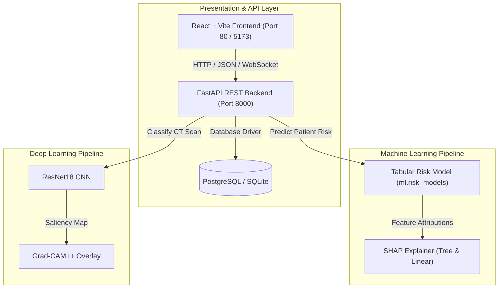

# StoneSense-AI

StoneSense-AI is an Explainable AI (XAI) decision-support platform for kidney-stone assessment. It independently analyzes structured urine biomarkers with clinical risk models (Logistic Regression, Random Forest, XGBoost) and CT scan slices with ResNet18, providing SHAP and Grad-CAM explanations for each evidence stream.

The project features a high-performance **FastAPI backend**, a modern **React (Vite + TypeScript + Tailwind CSS)** web dashboard, multi-hospital tenancy, and federated learning coordination.


```mermaid
flowchart TD
    Client["React + Vite Frontend (Port 80 / 5173)"]
    API["FastAPI REST Backend (Port 8000)"]
    DB[("PostgreSQL / SQLite")]

    subgraph Presentation["Presentation & API Layer"]
        Client -->|HTTP / JSON / WebSocket| API
        API -->|Database Driver| DB
    end

    subgraph MLPipeline["Machine Learning Pipeline"]
        API -->|Predict Patient Risk| RiskModel["Tabular Risk Model (ml.risk_models)"]
        RiskModel -->|Feature Attributions| SHAP["SHAP Explainer (Tree & Linear)"]
    end

    subgraph DLPipeline["Deep Learning Pipeline"]
        API -->|Classify CT Scan| ResNet["ResNet18 CNN"]
        ResNet -->|Saliency Map| GradCAM["Grad-CAM++ Overlay"]
    end
```

---

## Quick Start with Docker (Recommended for Production)

### 1. Configure Environment Secrets
Copy the template and configure your secrets in `.env`:
```bash
cp .env.example .env
```
*(On Windows PowerShell: `Copy-Item .env.example .env`)*

Update `.env` with your secure database password and JWT secret:
```env
POSTGRES_PASSWORD=your_secure_db_password
STONESENSE_JWT_SECRET=your_strong_random_jwt_secret_min_32_chars
ENVIRONMENT=production
```

### 2. Start All Services with Docker Compose
```bash
docker compose up --build -d
```

- **Web Dashboard**: [http://localhost](http://localhost) (Port 80)
- **FastAPI REST Backend**: [http://localhost:8000](http://localhost:8000)
- **API Documentation**: [http://localhost:8000/docs](http://localhost:8000/docs) (disabled in strict production mode)

### 3. Initialize & Seed Database in Docker
```bash
# Run Alembic migrations to head
docker compose exec backend alembic upgrade head

# Seed initial admin, developer, and hospital accounts
docker compose exec backend python -m backend.app.db.seed
```

---

## Local Development (Without Docker)

### Prerequisites
- **Python**: 3.11 or 3.12
- **Node.js**: 18.0 or 20.0+
- **Git**

### 1. Unified Python Virtual Environment Setup

#### On Windows (PowerShell):
```powershell
python -m venv .venv
.\.venv\Scripts\Activate.ps1
python -m pip install --upgrade pip setuptools wheel
pip install -r requirements.txt --extra-index-url https://download.pytorch.org/whl/cpu
pip install -e .
```

#### On Linux / macOS (Bash):
```bash
python3 -m venv .venv
source .venv/bin/activate
pip install --upgrade pip setuptools wheel
pip install -r requirements.txt --extra-index-url https://download.pytorch.org/whl/cpu
pip install -e .
```

### 2. Frontend Setup
```bash
cd frontend
npm ci
cd ..
```

### 3. Database Migrations & Initial Data Seeding

#### Apply Migrations with Alembic:
```bash
alembic upgrade head
```

#### Adopting an Existing SQLite Database:
If you have an existing database (`stonesense.db`), mark it as up-to-date with Alembic without rerunning tables:
```bash
alembic stamp head
```

#### Seed Initial Hospital & User Accounts:
```bash
python -m backend.app.db.seed
```

### 4. Running Backend & Frontend Locally

#### Windows (One-Click Launchers):
- Run both services simultaneously: `run_all.bat` or `.\developer_launcher.ps1`
- Backend only: `run_backend.bat`
- Frontend only: `run_frontend.bat`

#### Linux / macOS / Manual Commands:
```bash
# Terminal 1: Backend
uvicorn backend.app.main:app --host 127.0.0.1 --port 8000 --reload

# Terminal 2: Frontend
cd frontend
npm run dev
```

---

## Initial State & Model Deployment Lifecycle ("No Approved Model" Starting State)

StoneSense-AI features a strict **Deployment Gate** ensuring no unvalidated model is deployed to clinicians:
1. **Fresh Database State**: When a fresh database is initialized, model versions in `model_versions` are not automatically deployed.
2. **"No Approved Model" Handling**:
   - If no active model is marked as `is_deployed = 1` in the database, the API gracefully reports `status: "no_active_model"` or loads the verified fallback baseline from disk (`ml/models/registry_manifest.json`).
   - Saliency maps and risk calculations require an active model version or default to the baseline registry model.
3. **Deployment Gate Verification**:
   - Developer accounts trigger model candidate validation via `/api/v1/developer/models/evaluate-candidate`.
   - Only candidate models meeting all gate criteria (Accuracy $\ge$ 95%, F1 $\ge$ 94%, Tumor Recall $\ge$ 98%, Stone Recall $\ge$ 96%, Regression $\le$ 2%) are eligible for single-click promotion (`/api/v1/developer/models/deploy`).
   - Deployed models can be rolled back safely at any time via `/api/v1/developer/models/rollback`.

---

## Running Test Suites & CI

### Running Backend Tests
```bash
# Run fast test suite (skipping slow federated round simulations)
pytest -v -m "not slow"

# Run full test suite (including live federated multi-hospital simulation)
pytest -v
```

### CI Dataset Fixtures & Skipped Tests
- **Prediction Parity (`testing/test_prediction_parity.py`)**: Uses synthetic clinical DataFrame fixtures in CI environments when raw `ml/datasets/kidneyData.csv` is absent, verifying prediction tolerances ($< 10^{-7}$) and decision thresholds without external data dependencies.
- **Partition Leakage (`testing/test_partition_leakage.py`)**: Performs full MD5 hash isolation and count reconciliation across all 12,446 CT image files (`dl/datasets/partitions`). Because the raw image partition archive is gitignored, this module is skipped in lightweight CI runners (`pytest.mark.skipif(not PARTITIONS_DIR.exists())`) and executes locally during dataset verification.

### Running Frontend Tests & Linting
```bash
cd frontend
npm run lint
npm run build
cd ..
```

### Running Ruff Python Linter
```bash
ruff check backend/ ml/ dl/ testing/
```

---

## Project Structure

```text
StoneSense-AI/
├── backend/                  # FastAPI Application, Database Models & Services
│   ├── alembic/              # Alembic Database Migration Versions
│   ├── app/                  # Application core, routes, schemas, services
│   │   ├── api/v1/routes/    # Typed API endpoints (auth, hospital, developer, predict)
│   │   ├── config/           # Environment-driven settings (settings.py)
│   │   ├── core/             # JWT auth, security, startup routines
│   │   ├── db/               # SQLAlchemy models & database connection
│   │   └── services/         # Gate, XAI explainers, federated coordinator
│   └── tests/                # Backend API, auth, and prediction unit tests
├── frontend/                 # React 18 + Vite + TypeScript + Tailwind CSS UI
│   ├── src/                  # Pages, components, contexts, and API services
│   ├── eslint.config.js      # Minimal flat ESLint configuration
│   └── vite.config.ts        # Vite dev server and proxy config
├── ml/                       # Machine Learning Pipeline (Tabular Risk Models)
│   ├── risk_models/          # Abstract BaseRiskModel and registry code
│   ├── models/               # Model weights, versions (.pkl), and registry manifest
│   ├── artifacts/            # Scalers, pipelines, and feature order artifacts
│   └── preprocessing/        # Tabular validation & feature engineering
├── dl/                       # Deep Learning Pipeline (CT Slices ResNet18)
│   ├── federated/            # Flower FL strategy, local training, and manager
│   ├── models/               # ResNet18 weights (.pth) and training history
│   └── explainability/       # Grad-CAM visual heatmaps
├── infra/                    # Infrastructure configurations
│   ├── docker/               # Dockerfiles (Dockerfile.backend, Dockerfile.frontend)
│   └── nginx/                # Production Nginx reverse-proxy configuration
├── .github/workflows/        # GitHub Actions CI pipelines (linting & test suite)
├── docker-compose.yml        # Orchestration for Postgres, Backend, and Frontend
├── requirements.in           # Direct application requirements
├── requirements-dev.in       # Testing and developer extras
├── requirements.txt          # Pinned reproducible dependency lockfile
├── pyproject.toml            # Project packaging and tool configuration
└── pytest.ini                # Pytest configuration and test markers
```

---

## Security & Tenancy Rules

- **Authentication**: JWT tokens signed with SHA-256 HMAC. Secrets strictly sourced from environment variables.
- **Role-Based Access Control**:
  - `hospital_user`: Strictly scoped to own hospital's patient records and local training telemetry.
  - `developer`: Access to global federated training, model registry, and deployment gate metrics.
  - `admin`: Full system control, user management, and audit log inspection.
- **Data Isolation**: Zero raw CT image transfer during federated learning rounds (only model weight gradients exchanged).
- **Audit Logs**: Cryptographically tied audit records for every model deployment, rollback, and clinical authentication event.
